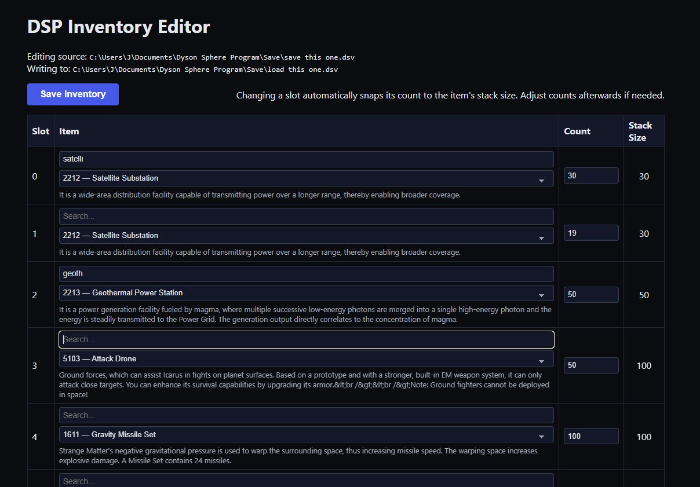

# DSP Save Parser

A Python-based toolkit for inspecting and editing Dyson Sphere Program (DSP) save data. In addition to the original parsing utilities, this fork adds a data-driven inventory catalog generator and a Flask-powered inventory editor for customizing every inventory slot from the browser.

Current game version supported: `0.10.33.27005` (Updated on 16 Oct, 2025)



## Quick Start (Windows)

```cmd
git clone https://github.com/jahoops/dsp_save_parser.git
cd dsp_save_parser
python -m venv .venv
.venv\Scripts\activate
pip install -U pip
pip install -e .
pip install flask
```

Update the hard-coded `SOURCE_SAVE` and `OUTPUT_SAVE` constants near the top of `inventory_editor.py`, `run_inventory_editor.cmd`, and any helper scripts so they point to the DSP save files you want to modify.

## Inventory workflow

### 1. Generate the item catalog

`generate_inventory_json.py` converts the curated `more_inventory_info.py` data dump into a searchable `inventory.json` containing every item’s metadata.

```cmd
python generate_inventory_json.py
```

The resulting `inventory.json` (173 entries) is consumed by both the editor and other automation scripts.

### 2. Launch the inventory editor

Run the Flask UI to view and edit every inventory slot in your save:

```cmd
run_inventory_editor.cmd
```

This helper script activates `.venv`, sets `FLASK_APP=inventory_editor.py`, and starts the development server. Visit the URL printed in the terminal (default `http://127.0.0.1:5000/`).

Key features:

- Displays all slots with the current item, stack size, and count pulled directly from the save file.
- Searchable, tooltip-rich dropdowns populated from `inventory.json` (real-time filtering, auto-select, item descriptions).
- Auto-adjusts counts to the selected item’s stack size; manual overrides are still allowed.
- Full-screen “Saving…” overlay plus success banner with timestamps so you always know when the write is in progress or complete.

Submitting the form writes changes into `OUTPUT_SAVE` using the same serialization logic as `test.py`, preserving other save data untouched.

### 3. Script quick reference

- `dump.py` – prints the current inventory contents to the console.
- `test.py` – example script that swaps specific items inside your save; useful for automation proofing.
- `inventory_editor.py` – Flask app described above.
- `run_inventory_editor.cmd` – Windows launcher for the Flask app.

## Traditional parser usage

+--------------------------------------------------------------------------------+
| The original documentation for parsing/serializing saves and blueprints remains |
| below for convenience. The new tooling sits on top of the same parser library.  |
+--------------------------------------------------------------------------------+

## Usage

### Parse DSV file (deserialization)

Example:

```python
import dsp_save_parser as s

with open('your_save_data.dsv', 'rb') as f:
    print(s.GameSave.parse(f))
```

`main.py` provides a basic skeleton structure for parsing a DSP save file: run `python main.py [save_data_path]` and it would print something like:

```text
<GameSave [0-74699601] (header=<VFSaveHeader>, file_length=74699601, version=7, is_sandbox_mode=0, is_peace_mode=0, major_game_version=0, minor_game_version=10, release_game_version=33, build_game_version=27005, game_tick=14591084, now_ticks=638964684498861177, size_of_png_file=260870, screen_shot_png_file=<bytes>, account_data=<AccountData>, dyson_sphere_energy_gen_current_tick=63584490, game_data=<GameData>)
```

*If `save_data_path` is not specified, the program will use the last exit save data `~\Documents\Dyson Sphere Program\Save\_lastexit_.dsv` by default.*

**A more advanced one -- exporting vein amounts for all explored planets:**

```python
from enum import IntEnum
from collections import defaultdict


class EVeinType(IntEnum):
    NONE = 0
    Iron = 1
    Copper = 2
    Silicium = 3
    Titanium = 4
    Stone = 5
    Coal = 6
    Oil = 7
    Fireice = 8
    Diamond = 9
    Fractal = 10
    Crysrub = 11
    Grat = 12
    Bamboo = 13
    Mag = 14
    MAX = 15


with open('xxx.dsv', 'rb') as f:
    data = s.GameSave.parse(f)
    planet_data_node_list = data.game_data.galaxy.data
    while planet_data_node_list is not None and planet_data_node_list.id != -1:
        amount_dict = defaultdict(int)
        # from 0.10.32.25783: vein data moved to GalaxyData
        for vein_data in planet_data_node_list.value.vein_groups:
            amount_dict[vein_data.type] += vein_data.amount
        amount_dict = {EVeinType(k).name: v for k, v in amount_dict.items()}
        print(planet_data_node_list.id, amount_dict)
        planet_data_node_list = planet_data_node_list.next
```

### Export to DSV file (serialization)

Write access is now supported. Here is an example:

```python
import dsp_save_parser as s

with open('your_save_data.dsv', 'rb') as f:
    data = s.GameSave.parse(f)

# do some modifications, for example:
data.account_data.user_name = 'my_name'  # change player's name
data.game_data.main_player.sand_count = 99999999  # modify sands
# if your changes affect the size of the save data, don't forget to re-calculate the whole file length
data.file_length = len(data)

# save changes
with open('your_modded_save_data.dsv', 'wb') as f:
    data.save(f)
```

Type casting for basic data types (uints, ints, floats, strings and their arrays) is automatically executed during calling `save` method.

If you changed the element counts in an array, don't forget to change its length attribute of the array:
```python
data.game_data.game_desc.saved_theme_ids.pop()  # remove element
data.game_data.game_desc.num_saved_theme_ids -= 1  # also decrease the array length manually
```

### Parse blueprint text file (deserialization)

`blueprint.py` provides the necessary codes for parsing blueprint files. Run `python blueprint.py your_blueprint_file_path.txt` can print something like:

```text
Blueprint(layout=<EIconLayout.ONE_ICON: 10>, icon0=2206, icon1=0, icon2=0, icon3=0, icon4=0, time=datetime.datetime(2023, 10, 29, 23, 0, 50, 869514), game_version='0.9.27.15466', short_desc='capacitor100-90mw', desc='', data=<BlueprintData [0-6147] (version=1, cursor_offset_x=14, cursor_offset_y=14, cursor_target_area=0, drag_box_size_x=28, drag_box_size_y=28, primary_area_idx=0, num_areas=1, areas=<list>, num_buildings=100, buildings=<list>, patch=1, has_reform_data=None, reform_data=None)>)
```

## File structure

### DSV Save format

Refers to [save_format.txt](dsp_save_parser/save_format.txt) for detail. It should be quite straightforward and easy-understanding, maybe?

As for the meaning of each field, ask the developers rather than me.

### Blueprint format

Refers to [blueprint_format.txt](dsp_save_parser/blueprint_format.txt) for detail.
